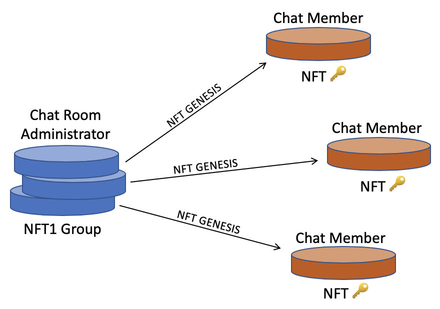
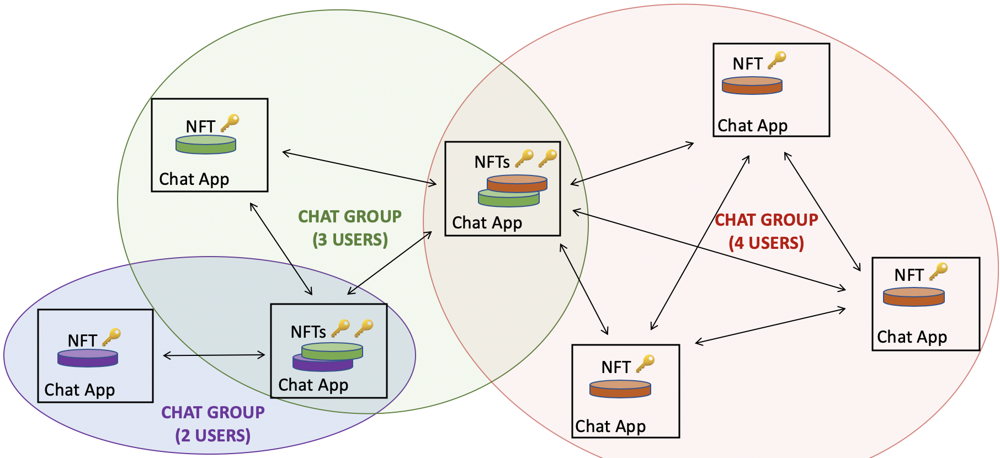
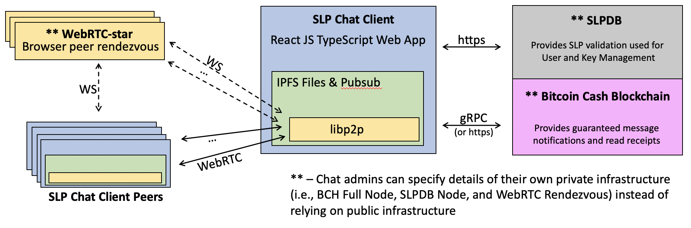
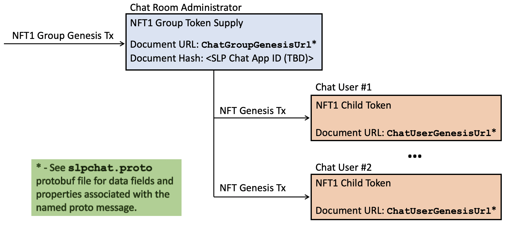
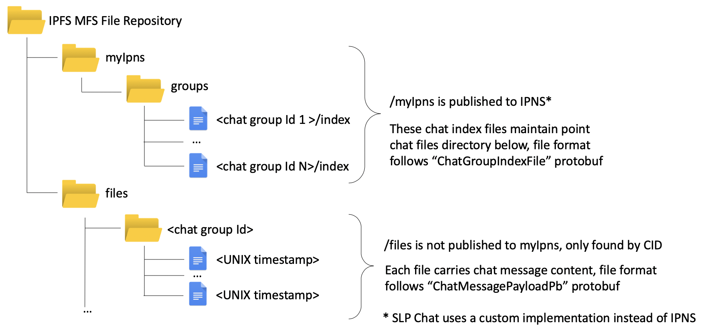

# SLP Chat D-App Specification - DRAFT

***A decentralized peer-to-peer group chat system using SLP tokens***

**Last updated: May 19, 2020**


## Introduction

SLP Chat is a decentralized application (d-app) for participating in peer-to-peer group chat rooms with end-to-end encryption and message notifications hardended by bitcoin transactions.  The application is open source and is designed in a way to permit interoperation with other implementations without requiring dependence on third-party services.  Chat room users can restore their chat group history by simply restoring their 12-word mnemonic seed phrase as long as one other group member is online to share chat history.

The unique and highly motivating features this application will provide include:

* group chat rooms with end-to-end encryption
* high assurance message delivery and read receipt confirmations guarenteed by bitcoin transactions
* native bitcoin and SLP token tipping
* integrated workflows for interacting with smart contracts with chat group participants

Group chat rooms are easy to setup and only require issuance of an [NFT1 Group](https://slp.dev/specs/slp-nft-1/) token by a chat room administrator, and users are added to the chat group be creating of NFTs from the NFT1 group which are sent to the chat room users.  The public key for each chat room member is embedded in the NFT genesis transaction and is used as the peer's identity in the peer-to-peer network and end-to-end message encryption.




Once users are holding one or more chat room NFT tokens in the SLP chat app's integrated wallet users can connect and securely message with the other online members of their groups.  The following figure illustrates the relevant p2p network topology of users belonging to different chat groups.




## Application Architecture

A reference client *(currently in alpha)* for the SLP chat application has been built using TypeScript and ReactJS UI framework.  The core of the chat application leverages [IPFS](https://ipfs.io) for peer-to-peer messaging and files storage, and uses [SLPDB](https://github.com/simpleledger/SLPDB) for updating SLP token information and wallet balance information.



Peer-to-peer connections between chat room users in the browser is accomplished using WebRTC and is handled automatically by the [libp2p](https://github.com/libp2p/js-libp2p) javascript library.  The chat room administrator must select a rendezvous point for the chat room peers to initiate and establish the p2p connection between users using one or more [WebRTC-star](https://github.com/libp2p/js-libp2p-webrtc-star) servers.   To be clear, no chat messages are not routed through this webRTC-star server, its purpose is purely for the purpose of peer discovery and introductions.

Both SLPDB and the WebRTC services can be configured by the chat room administrator and are not dependent on a third-party.  Most group admins would likely just leverage public WebRTC-star and SLPDB servers.

Some situations do not allow a reliable connection via WebRTC.  Unreliable webRTC performance has been found to occur when a user is using a VPN, which is a basic requirement for many users.  Also offline users will never receive webRTC notifications since they are not not persisted to a data store.  Therefore, in order to provide high assurance for message notifications user message hashes will be published as a bitcoin transaction on the Bitcoin Cash blockchain as a payload as part of a Bitcoin Files Protocol transaction.

## SLP Token Data Scheme

SLP Chat stores a small amount of information about chat groups and its chat group members in the "document url" and "document hash" fields of SLP Genesis transactions.  The following diagram illustrates the types of data stored within the NFT1 Group and NFT child token Genesis transactions.

New chat groups can be publicly listed as a known chat group ID by including the SLP chat application ID (currently not yet set in stone) within the "document hash" field of the chat group NFT1 Group.  Not including the SLP chat app ID will result in a chat group that will not be listed as a known chat group and would require manually adding the group ID in the SLP application client.




## IPFS Data Scheme

Users communicate with peers in real-time using libp2p pubsub for all messaging.  Message types related to new message notifications and read receipts require high assurance, and so they need to also be published as bitcoin transactions using [Bitcoin Files Protocol](https://github.com/simpleledger/slp-specifications/blob/master/bitcoinfiles.md). 

There are currently only three types of messages sent via pubsub:

* `GROUP_SEND` - Used for sending a new group messages to connected peers (requires initial BFP transaction, then pubsub w/ topic=groupid)
* `NAME_REQUEST` - Used for requesting the current "myIpns" directory CID for a particular peerId (pubsub only w/ topic=peerid)
* `NAME_RESPONSE` - Used for responding with the best known "myIpns" directory CID for a particular peerId (pubsub only w/ topic=peerid)
* `NAME_UPDATE` - Used for updating all subscribing peers with own name CID (pubsub only w/ topic=peerid)
* `READ_RECEIPT` - Used for provide confirmation to the sender that a message was received and viewed (simultaneous pubsub w/ topic=groupid and BFP transaction)

Users store and pin their own messages on a locally running IPFS node.  Admins can provide.  The directory structure for the files stored by each user is illustrated below.

The IPFS files repository contains two main directories, `myIpns` and `files`.  

* `myIpns` is a lightweight directory used as an index for finding all the directories storing a user's group chat messages or admin group settings information.  The directory is discovered via a custom name resolution system kind of like IPNS.

* `files` is where a user's actual chat files are stored.  A user only stores their own chat messages within the files directory structure.  Messages from other users within the group are stored but are only found by CID and not through the files directory structure.  Each message is stored within the respective group chat id folder having a file name of the message timestamp.




### Messaging and File Formats

The format for all messages between peers and files are defined using the following protobuf message definitions.  Some of the message definitions have not yet been implemented in the reference SLP chat application and are subject to change by the time this initial version of this specification is published.

```protobuf
  syntax = "proto3";

  // This message is used by all users located in the users's MFS
  // at: /myIpns/groups/<group id hex>/index
  message ChatGroupIndexFile {
    string user_msg_dir_cid = 1;     // req, the CID hash of a directory containing the user's chat files for this group
    string admin_group_info_cid = 2; // opt, used by admins only
    string handle = 3;               // opt, user can set a custom handle for identification within the group
  }

  // This message can be optionally included within the Group Chat NFT1 Genesis transaction
  // documentURL field as a binary payload.  It's primary purpose is to provide a pointer
  // to the IPNS peerId (secp256k1 pubkey) that is storing the mutable information and rules 
  // about the group chat that the chat users can resolve.
  //
  // Note that this message is separate from the 32 byte SLP chat application ID which
  // should be included within the document hash field of the same NFT1 Group Genesis
  // transaction.
  //
  // Currently this is not implemented anywhere.
  //
  message ChatGroupGenesisUrl {
    bytes admin_pubkey = 1;         // req, the public key associated with the administrator controlling the details of the group
  }

  // Group admin only: this is an optional document to provide
  // general information, rules etc., about the particular group chat.
  //
  // Currently this is not implemented anywhere
  //
  message ChatGroupInfoFile {
    int64 spec_version = 1;              // the spec version that new messages should follow, starts v1
    string group_name = 2;               // opt, group name
    string group_description = 3;        // opt, description
    string url = 4;                      // opt, any url linked to info about the group
    bool require_encryption = 5;         // req, will admin acknowledge unencrypted messages from clients
    bool hardened_notifications = 6;     // req, p2p messages shall be hardened using BPF to prevent libp2p failure
    bool confidential_conversation = 7;  // req, the information in the group is strictly confidential
    repeated string swarm_addresses = 8; // opt, list of swarm addresses users should use for p2p connection 
    repeated string slpdb_addresses = 9; // opt, list of slpdb urls available to the users (can be private)
    repeated string bch_addresses = 10;  // opt, list of full nodes available to the users (can be private)
    // ipfs_http_url = 11;               // future, pinning server url
  }

  // This message is for each chat user and shall be included
  // within the documentURL field of the user's NFT Genesis transaction.
  message ChatUserGenesisUrl {
    bytes user_pubkey = 1;       // req, the public key associated with the user's identity
  }

  // This message represents the actual chat messages themselves, it is used
  // for both the payload within a chat message delivered via pubsub or when 
  // fetch as a file from IPFS when resolving chat history
  message ChatMessagePayloadPb {
    enum ChatFileType {
      UTF8 = 0;                  // used for clear text chat messages
      FILE = 1;                  // used for clear file transfer
      ECIES_SECP256K1_UTF8 = 2;  // used for encrypted text chat messages
      ECIES_SECP256K1_FILE = 3;  // used for encrypted fil transfer
    }
    message ChatMessagePayloadItemPb {
      bytes payload = 1;         // req, message payload having a format identified by "type"
      bytes pubkey = 2;          // opt, pubkey identifying the intended recipient of the payload
    }
    ChatFileType type = 1;
    repeated ChatMessagePayloadItemPb payload = 2;
    string filename = 3;
  }

  // This is an envelope indicating which
  // type of pubsub message is being sent
  message PubsubEnvelope {
    enum PubsubType {
      GROUP_SEND = 0;
      NAME_REQUEST = 1;
      NAME_RESPONSE = 2;
      NAME_UPDATE = 3;
      READ_RECEIPT = 4;
    }
    PubsubType type = 1;    // req, type of pubsub message
    bytes payload = 2;      // opt, pubsub message payload having format identified by "type"
  }

  // This is a GROUP_SEND message notification is to be transported via libp2p pubsub and
  // as a Bitcoin Files Protocol (BFP) payload.
  // 
  // Transport requirements:
  // * pubsub: shall be published with topic=<group_id_hex_lowercase>
  // * BFP: shall be published with dust being sent to the sender
  //
  message PubsubGroupSend {
    bytes groupid = 1;
    int64 time = 2;
    string msg_cid = 3;
    string msg_dir_cid = 4;
    string name_dir_cid = 5;
    bytes name_dir_cid_sig = 6;   // v1 req
    bytes message = 7;            // v1 opt, include the chat message payload (associated with msg_cid) for fast client loading
  }

  // This is the pubsub payload for NAME_REQUEST
  message PubsubNameRequest {
    string peerid = 1;
    int64 time = 2;
    string prev_cid = 3;
    bytes prev_sig = 4;
  }

  // This is the pubsub payload for NAME_RESPONSE
  message PubsubNameResponse {
    string peerid = 1;
    string cid = 2;
    int64 time = 3;
    bytes cid_sig = 4;
  }

  message PubsubReceipt {
    string cid = 1;
  }

  // This data structure can be used to persist the Mapping of
  // peer chat content to be pinned
  message ChatRoomPinMap {
    message MapItem {
      string peerid = 1;
      bytes groupid = 2;
      string cid = 3;
    }
    repeated MapItem pinset = 1;
  }

  // This data structure can be used to persist the Mapping of
  // PeerId->myIpns dirctory of each peer
  message NamePinMap {
    message MapItem {
      string peerid = 1;
      string cid = 2;
      int64 time = 3;
      bytes cid_sig = 4;
    }
    repeated MapItem pinset = 1;
  }
```
