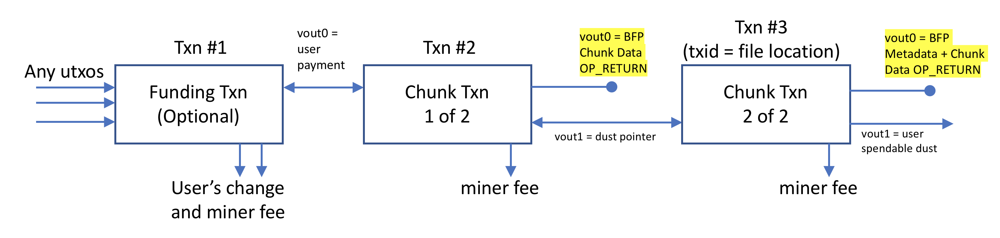

# Bitcoin Files Protocol Specification

### Specification version: 0.6
### Date orginally published: September 21, 2018

### URI: [bitcoinfiles.com](bitcoinfiles.com)

## Authors
James Cramer, Attila Aros, hapticpilot

## Acknowledgements
Mark Lundeberg, Jonald Fyookball, Calin Culianu, Adam Gall for various suggestions and considerations

## 1. Introduction
The following presents a simple protocol for adding files to the Bitcoin Cash blockchain. The protocol also allows for creating immutable URIs (Uniform Resource Identifiers) pointing to off-chain data storage systems. The motivation for this protocol was driven by the lack of reliable and anonymous file upload and storage systems, which have a simple API.

The original purpose of this protocol was to facilitate the uploading of JSON documents associated with a SLP token's GENESIS transaction. BFP is a separate protocol from SLP Tokens, but its design uses a DAG (Directed Acyclic Graph) to link file chunks and metadata together in multiple transactions so in a way it is similar to SLP tokens.

## 2. Protocol

This protocol specification describes the requirements for handling the storage of URIs and complete files within the Bitcoin Cash blockchain.

### 2.1 BFP Types

Unique BFP message types are used to represent different constructs in the BFP protocol. In any BFP OP_RETURN message, the BFP message type is represented by the required field named `bfp_msg_type`. There are currently three types of BFP constructs. They are:

- `bfp_msg_type = 0x01`: A file (OP_RETURN storage).
- `bfp_msg_type = 0x02`: A file (P2SH storage).
- `bfp_msg_type = 0x03`: A folder.

### 2.2 A File (BFP Message Type = 0x01)

Files are uploaded to the blockchain in a series of data chunks encapsulated within OP_RETURN messages located at vout=0 (i.e. the first output) in each data chunk's respective transaction.  The file chunks reference each other using the vout=1 output as a pointer to the location of the next data chunk.  The file can be shared with anyone by sharing the transaction hash of the last uploaded data chunk containing optional file metadata.  The following illustration shows an example two-part file upload using this protocol.

**Figure 1: A file uploaded to the blockchain using an initial funding transaction followed by two data chunks transactions.  Data stored within OP_RETURN space is highlighted in yellow.**

The transaction hash belonging to the final transaction made in the series of uploaded data chunks represents the file's physical location in the blockchain data structure.  This final transaction contains a special set of file metadata parameters including the number of chunks associated with the file which is required for downloading the file.

It is recommended that an initial funding transaction be created (as shown in the above figure) to cover the costs of all subsequent transactions.  The benefits of using an initial funding transaction include simplified coin management and reduced overall upload cost since each data chunk's transaction only has 1 input.

#### 2.2.1 Rules for on-chain file uploads

1. **Data Chunk Order:** Data chunks shall be ordered in the order that the transactions are signed.  This means the first chunk of the file represents the first part of the file and is signed first.  The last data chunk of the file is signed last and may be placed within the final metadata transaction if there is sufficient room.

2. **Metadata OP_RETURN Message:** The final signed transaction for a file upload must contain an OP_RETURN output message located at output index 0 (i.e., vout:0).  The required format for this final message is:
   *  `OP_RETURN <lokad_id_int = 'BFP\x00'> <bfp_msg_type = 0x01> <chunk_count_int> <filename_utf8*> <file_extension_utf8*> <file_byte_count_int*> <file_sha256_bytes*> <previous_file_sha256_bytes*> <file_uri_utf8*> <chunk_X_data_bytes*>`
   * If the file includes only 1 data chunk *AND* that data chunk can fit within the metadata transaction then only a single transaction is required for the upload.
   * If the file includes multiple data chunks a Data Chunk OP_RETURN transaction described below shall be used to facilitate uploading of the data chunks.
   * NOTE: The `previous_file_sha256_bytes` field can be filled in with either a previous file hash or a previous BFP file transaction hash.  This is left up to the application developer.
3. **Data Chunk OP_RETURN Message:** For any non-final data chunk transaction (meaning not the Metadata transaction) output index 0 (i.e., vout: 0) shall contain the OP_RETURN message with the following format:
   *  `OP_RETURN <chunk_X_data_bytes>`

4. **Data Chunk Transaction Baton:** For any non-final data chunk transaction a baton shall be used as a reference pointer to the file's next data chunk or metadata. Output index 1 (i.e., vout: 1) shall contain the UTXO dust that shall be spent in the next data chunk or metadata transaction.  The baton shall be spent as the first input (i.e., vin: 0) of the next data chunk or metadata.

#### 2.2.2 Procedure for downloading on-chain files

Files are located on the blockchain using the hash of the transaction containing the file's Metadata OP_RETURN message. In order to download the full file content the software implementation simply needs to follow the following steps:

1. Download the file's metadata transaction
2. Parse for Metadata OP_RETURN message located at the first output (i.e., vout:0) within that transaction
3. If `chunk_count` = 1 *and* a data chunk is provided within the metadata message then the procedure is complete and the file can be reconstructed from the data chunk contents.
4. If `chunk_count` = 0 the file is not being stored on-chain.  Even if `chunk_data` is not empty the data chunk should be treated as if it isn't there by an implementation.  An off-chain only file can be stored if `chunk_count` = 0 *and* `file_uri_utf8` is not empty; this may be valuable for applications where having immutable store of file metadata has value.
5. If there are more chunks that need to be downloaded then use the transaction hash specified at vin:0 to find the next data chunk and parse data chunk transactions using the "Data Chunk OP_RETURN" format.
6. Repeat step 4 until all of the data chunks have been parsed.
7. Assemble the file from the data chunks using the first signed = first chunk rule.

#### 2.2.3 Procedure for downloading off-chain files

Cases where `file_uri_utf8` is provided to an off-chain storage location implementations may elect how to handle downloads.  Use of IPFS is recommended and additional considerations for using IPFS have been provided in Appendix A.

### 2.3 A File (BFP Message Type = 0x02)

Larger files (~100KB) may be stored on-chain using `bfp_msg_type` 0x02. This type is nearly identical to the 0x01 file type, however, files are uploaded to the blockchain in a series of data chunks encapsulated within the spending of P2SH outputs within `scriptSig` spaces and `OP_RETURN` outputs. The file can be shared with anyone by sharing the transaction hash of the last uploaded data chunk containing optional file metadata.  

The scripts below are designed with the following transaction limits in mind:

- Max script element size of 520 bytes (consensus limit)
- Max `scriptSig` size of 1650 bytes per input (standardness limit)

Unlocking script shall have the following format (adhering to the P2SH specification):
`<signature> <public key> <push1> <push2> <redeem script>`

Redeem script shall have the following format:
`OP_HASH160 OP_SWAP OP_HASH160 OP_CAT OP_2DUP OP_CAT OP_HASH160 <hash> OP_EQUALVERIFY <push3> OP_2DROP OP_CHECKSIGVERIFY OP_DEPTH OP_NOT`

where `hash`: `HASH160(public key || HASH160(push2) || HASH160(push1))`

For maximum efficiency, it is suggested that

- `push 1` is of length `520` bytes
- `push 2` is of length `493` bytes (`501` if `signature` is Schnorr-signed)
- `push 3` is of length `484` bytes

P2SH outputs shall follow immediately after the `OP_RETURN` push starting at `vout=1`. They shall be contiguous, and spent in the same order starting at `vin=0`. For example, `vout=1` would be spent in `vin=0`, `vout=2` spent to `vin=1`, etc.

To upload, for every transaction:
- P2SH outputs are redeemed in the order that increasing `vin` corresponds to increasing data index (Not applicable to the initial transaction)
- The `OP_RETURN` output is formed
- P2SH outputs are formed

The last transaction, redeeming P2SH outputs but not creating newer ones, shall have a metadata-containing `OP_RETURN` push which may also contain data.

Padding shall be added to satisfy the conditions that the redeem script above is valid and that every P2SH push is at least `110` bytes. While reading, the bytes after `file_byte_count_int` given in the metadata will be discarded.

In this protocol, `chunk_count_int` refers to the number of transactions that have `OP_RETURN` data pushes (including the last transaction unless it is metadata-only).

To read transactions from the latest to the earliest the following procedure is suggested, where `chunks` is a push-to-end sequence of byte arrays:
- Read the metadata-containing `OP_RETURN` push
- If the `OP_RETURN` push contains data (`chunk_X_data_bytes`), append it to `chunks` and subtract 1 from transactions-to-be-read
- Append the concatenated P2SH input pushes with increasing index as one element to `chunks`
- Loop reading previous transactions until the number of transactions given in the metadata is read
- - Append the `OP_RETURN` push to `chunks`
- - Append the concatenated P2SH input pushes with increasing index as one element to `chunks`
- Reverse the order of byte arrays in `chunks` (but not the arrays themselves)
- Concatenate `chunks` to form a byte array

### 2.4 Folders (BFP Message Type = 0x03)

A folder message type stores one or more transaction hashes pointing to files and other folders.  This type of message simply provides a list of transaction hashes.

#### 2.4.1 Rules for creating folders

1. **Metadata Transaction OP_RETURN Message:** A single transaction containing an OP_RETURN message at output index 0 (i.e., vout:0).  The required format for a new folder is:

   * `OP_RETURN <lokad_id_int = 'BFP\x00'> <bfp_msg_type = 0x02> <list_page_count> <folder_name*> <folder_description*> <txid_0_int> ... <txid_i_int*> ... <txid_n_int*>`

     Where `<txid_0_int>`  and `<txid_x_int*>` represent a transaction hash pointing to another BFP folder or BFP file.  At least one transaction hash is required and additional optional transaction hashes may be provided.

2. **List Page OP_RETURN Message:** An infinite number of BFP files and folders can be referenced by a BFP folder by using a List Page OP_RETURN Message.  The number of list pages should be specified within the Metadata Transaction OP_RETURN and needs to be greater than 1 to indicate use of List Pages.  The required format for a list page message is:

   - `OP_RETURN <txid_0_int> ... <txid_i_int*> ... <txid_n_int*> `

3. **List Page Baton:**  For any list page transaction a baton is used to create a reference pointer from a folder Metadata transaction to a List Page transaction.  Output index 1 (i.e., vout: 1) shall contain the UTXO dust that shall be spent in the next transaction as the first input (i.e., vin: 0) to create the valid reference.  The next transaction after a List Page transaction can be either another List Page transaction *OR* at the folder's Metadata transaction.

#### 2.4.2 Procedures for discovering files within a folder

The rules for determining what files and folders are contained within in a folder are simple.  An implementation shall parse the Metadata OP_RETURN message and any upstream List Page OP_RETURN message transactions using the specified format for the Metadata and List Page OP_RETURN messages.

## 3. OP_RETURN Syntax and Format Requirements

1. Data fields are represented using the field's name within angle brackets (i.e.,  `<some_field_name>` )
2. Optional fields are indicated using `*` at the end of the field's name, and can be left empty using the push code `0x4c 0x00`, or `0x4d 0x00 0x00`, or `0x4e 0x00 0x00 0x00 0x00`.
3. Data push opcodes are not presented above. For each field an appropriate data push code shall be utilized.
   - Only opcodes `0x01` to `0x4e` are permitted (after OP_RETURN). Note this means that not all push opcodes are allowed -- it is forbidden to use the empty-push opcode `0x00` (`OP_0`) or 1-byte literal push opcodes `0x4f`-`0x60` (`OP_1` through `OP_16` and `OP_1NEGATE`) anywhere in the OP_RETURN. For example, it is invalid to use `0x58` to push the number '8' in the 1-byte `chunk_count_int` field of the Type 0x01 file transaction message, even though in normal bitcoin script the opcode `0x58` is effectively equivalent to `0x01 0x08`  (push [`0x08`]). For this reason some standard bitcoin script decompilers, that treat all push opcodes on equal footing, must not be used for parsing BFP transactions.
   - Bitcoin script allows a given byte array to be pushed in various ways, and we allow this in BFP as well. For example, it is valid to push a 4-byte chunk (like the Lokad ID) in four different ways: `0x04 [chunk]`, `0x4c 0x04 [chunk]`, `0x4d 0x04 0x00 [chunk]`, or `0x4e 0x04 0x00 0x00 0x00 [chunk]`.
4. The Lokad Terab id for BFP is `0x00504642` which results in the string literal `BFP\x00` when pushed onto the stack using little-endian byte ordering.  More information about Lokad Terab project identifiers can be found [on GitHub](https://github.com/Lokad/Terab/blob/master/spec/opreturn-prefix-guideline.md).
5. Endianness: All data pushes, other than the Lokad protocol identifier, shall be pushed to the Script stack using big-endian data byte ordering.
6. The data encoding for each variable is included as the final part of the variable name.

## 4. Bitcoinfile URI

This part of the specification is not a protocol rule and is only a recommendation for an improved user experience.  It is recommended that a prefix of "bitcoinfile:" be used for the transaction hash/id representing either on-chain or off-chain file.  In the future the concept of folders can be added to this protocol and the prefix of "bitcoinfiles:" should be used.

For example:

`bitcoinfile:<txid-of-a-file>`

`bitcoinfiles:<txid-of-a-folder>`

The usage of a transaction id prefix shall have no impact on the protocol rules, and implementations should completely ignore the prefix if it is provided by the user.  Only the transaction hash/id matters when determining the content of a BFP message.

## 5. Other Considerations

1. Network rules currently limit the number of chained transactions to 25 per block, this limits the data throughput of this protocol to slightly more than 5kB files.  Implementations will need consider the number of chained transactions a UTXO may already has before creating a file upload.  For example, the file upload may be limited to fewer than 25 transactions if the user has made several transactions prior to the file uploads within the same block height.
2. Set a limit for file upload sizes to encourage wise use of blockchain space
3. File data can be encrypted in a number of ways.  At this time it is recommended that the file extension field be utilized to convey the type of encryption if the native file format does not have internal mechanism for handling encryption (e.g., PDF).
4. In some cases of file record keeping having the ability to reference a previous file version's hash for informational purposes can be very useful.  For this reason the metadata field named `<previous_file_version_sha256_bytes*>` has been provided.

## 6. Specification Updates

* **v0.2 - September 26, 2018**
  * Added BFP Message Type ( `bfp_msg_type` )
  * Added folder BFP Message Type = 0x03
  * Added file URI preferences
  * Added file encryption considerations
  * Added Appendix A - IPFS Considerations
  * Added co-authors Attila Aros and hapticpilot

## 7. Appendix A - IPFS Usage

#### 7.1 IPFS downloads

[IPFS](https://ipfs.io) is a system for storing and distributing files. The key benefit of IPFS is decentralization and consistent addressability.  An IPFS can be used for storing files off-chain as either a cache or a more efficient means of data storage.

The URI location for a file stored on IPFS is uniquely determined by the file's hash (and a few other settings explained below shortly).  The OP_RETURN messages presented in Sections 2.2.1.2 and 2.4.1.1 allow for `<file_uri_utf8*>` which should be leveraged when using IPFS URIs.

- User agent *may* choose to query an IPFS gateway of their choice after retrieving a BFP file's Metadata transaction.

There are numerous public gateways available that would be suitable options for resolving IPFS URIs.

For example, for a IPFS file with hash `Qmc5gCcjYypU7y28oCALwfSvxCBskLuPKWpK4qpterKC7z` the `<file_uri_utf8*>` field should be set to something like: `https://gateway.ipfs.io/ipfs/Qmc5gCcjYypU7y28oCALwfSvxCBskLuPKWpK4qpterKC7z`, allowing a user agent to interpret this URI and download the file from an IPFS gateway.  User agent's may consider the following:

- User browser agent *may* choose to query an IPFS swarm directly instead using a pure Javascript/Browser implementation such as [js-ipfs](https://github.com/ipfs/js-ipfs).
- User agent *may* to set a time limit for how long they are willing to wait for IPFS to resolve the content, and instead opt for retrieving the individual chunk transactions to serve their request instead.
- If the content is not retrievable or not found on IPFS, then the user *may* re-upload the content to IPFS after retrieving the content bytes from the transaction chunks.

The next section highlights considerations for performing an upload as there are some IPFS specific flags that need to be set consistently to arrive at the same IPFS hash.

#### 2.4.2.2 IPFS uploads

IPFS hashes are uniquely determined by a few parameters, not simply the sha256 hash of the file content. This is unavoidable since IPFS provides different storage options, identifier versioning, and also needs some flexibility for the future.

IPFS options (which determine the IPFS hash created with `ipfs add -n`)

- Chunking algorithm (--chunker option)
- DAG format (--trickle option)
- CID version (--cid-version option)
- Hashing algorithm (--hash option)
  [Source](https://discuss.ipfs.io/t/how-to-calculate-file-directory-hash/777/4)

**Defaults**

--chunker:  `size-262144` (1024*256)

--trickle: false

--cid-version: CIDv0 (Starts with 'Qm...') Note: this is a [self-describing format](https://github.com/ipld/cid#versions) and therefore can be uniquely determined by looking at the hash prefix

--hash: sha256

At the time of writing, the latest version of IPFS is `ipfs version 0.4.17` and the defaults described above are accurate for this version.

It is *recommended* that user agents calculate the IPFS hash for a file using `ipfs add -n` (and the necessary parameters). This will ensure maximum compatibility for other users, in the event that the content has been garbaged collected from all live IPFS nodes and a user wishes to make the content available again under the same IPFS hash.

The facilite being able to easily recreate the IPFS hash, we are *recommending* that users include additional/optional URI query params to inform clients what IPFS hashing options were used.

Query format example:
`Qmc5gCcjYypU7y28oCALwfSvxCBskLuPKWpK4qpterKC7z?ver=<string>&chunker=<string>&trickle=<int>&hash=<string>`

It is *recommended* that the user agent sets these parameters for all the command line options for `ipfs add -n` and then provides these values  explicitly to enable others to create the precise hash.  On the other hand, the defaults are not expected to change anytime soon, therefore as long as the user is using an unmodified version of ipfs, then they should be able to easily obtain the same hash.

Examples:

Only IPFS version is defined (default and best effort to attempt to recreate hash)
`Qmc5gCcjYypU7y28oCALwfSvxCBskLuPKWpK4qpterKC7z?ver=0.4.17`

- ver: `0.4.17` is the known working version of IPFS that hash was created with

Just the IPFS hash is provided (default and best effort to attempt to recreate hash)
`Qmc5gCcjYypU7y28oCALwfSvxCBskLuPKWpK4qpterKC7z`

All options explicitly defined: (will yield the same hash if all options are matching)
`Qmc5gCcjYypU7y28oCALwfSvxCBskLuPKWpK4qpterKC7z?ver=0.4.17&chunker=size-262144&trickle=0&hash=sha256`

- ver: `0.4.17` is the known working version of IPFS that hash was created with
- chunker: `size-262144` is the default value
- trickle: `0` is disabled by default
- hash: `sha256` is the default algorithm

All options explicitly defined except chunker: (will yield the same hash if all options are matching)
`Qmc5gCcjYypU7y28oCALwfSvxCBskLuPKWpK4qpterKC7z?ver=0.4.17&trickle=1&hash=sha256`

- ver: `0.4.17` is the known working version of IPFS that hash was created with
- trickle: `1` is disabled by default

The user agent can infer that `chunker` and `hash` should be the default values as of version 0.4.17 and to enable `trickle`.
