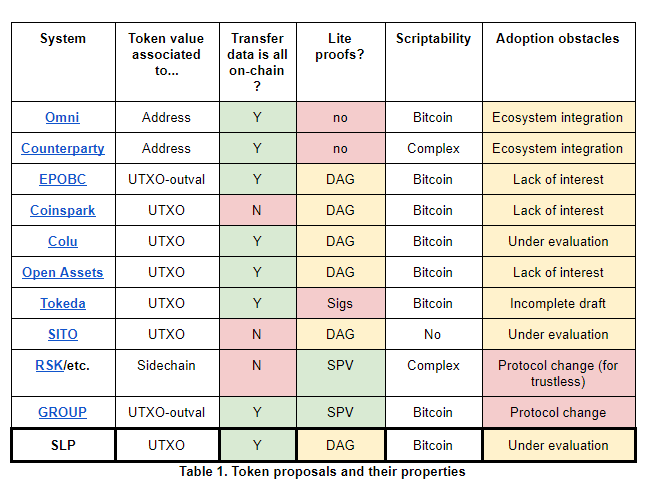
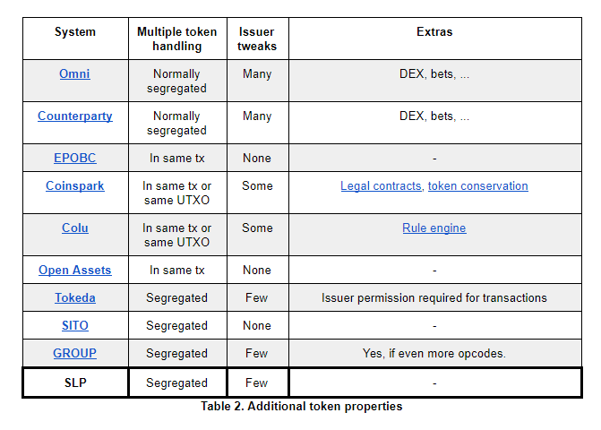
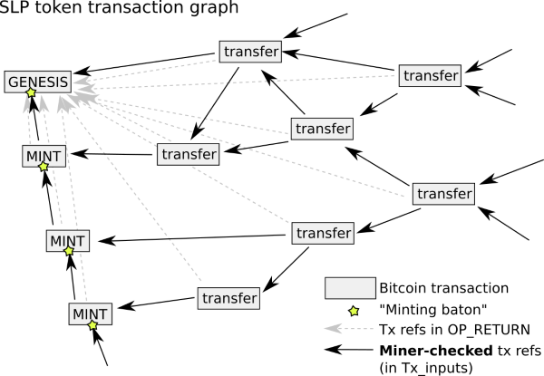

# SLP Token Type 1 Protocol Specification
### Specification version: 0.3
### Date published: August 21, 2018

## Authors
Jonald Fyookball, James Cramer, Unwriter, Mark B. Lundeberg, Calin Culianu, Ryan X. Charles

## Acknowledgements
Amaury Sechet, for suggesting merklix based hash committments

Andrew Stone, for the token descriptor and baton ideas

Dexx7, for code review and ideas

# Table of Contents
[SECTION I: BACKGROUND](#section-i-background) 
&nbsp;&nbsp;&nbsp;&nbsp;[Introduction](#introduction) 
&nbsp;&nbsp;&nbsp;&nbsp;[Summary](#summary) 
&nbsp;&nbsp;&nbsp;&nbsp;[Use Cases](#use-cases) 
&nbsp;&nbsp;&nbsp;&nbsp;[Requirements](#requirements) 
&nbsp;&nbsp;&nbsp;&nbsp;[Comparison to other token schemes](#comparison-to-other-token-schemes) 
&nbsp;&nbsp;&nbsp;&nbsp;[Design Philosophy and Challenges ](#design-philosophy-and-challenges) 
&nbsp;&nbsp;&nbsp;&nbsp;&nbsp;&nbsp;&nbsp;&nbsp;[Simplicity and Consensus](#simplicity-and-consensus) 
&nbsp;&nbsp;&nbsp;&nbsp;&nbsp;&nbsp;&nbsp;&nbsp;[Why SPV-friendly permissionless tokens are difficult](#why-spv-friendly-permissionless-tokens-are-difficult) 
&nbsp;&nbsp;&nbsp;&nbsp;&nbsp;&nbsp;&nbsp;&nbsp;[Hybrid Security Model](#hybrid-security-model) 

[SECTION II: PROTOCOL DESCRIPTION](#section-ii-protocol-description) 
&nbsp;&nbsp;&nbsp;&nbsp;[Protocol Overview](#protocol-overview) 
&nbsp;&nbsp;&nbsp;&nbsp;[Consensus Model](#consensus-model) 
&nbsp;&nbsp;&nbsp;&nbsp;&nbsp;&nbsp;&nbsp;&nbsp;[Checksum commitments](#checksum-commitments) 
&nbsp;&nbsp;&nbsp;&nbsp;[Consensus Rules](#consensus-rules) 
&nbsp;&nbsp;&nbsp;&nbsp;&nbsp;&nbsp;&nbsp;&nbsp;[Considerations](#considerations) 
&nbsp;&nbsp;&nbsp;&nbsp;[Transaction Detail](#transaction-detail) 
&nbsp;&nbsp;&nbsp;&nbsp;&nbsp;&nbsp;&nbsp;&nbsp;[Formatting](#formatting) 
&nbsp;&nbsp;&nbsp;&nbsp;&nbsp;&nbsp;&nbsp;&nbsp;[GENESIS - Token Genesis Transaction](#genesis---token-genesis-transaction) 
&nbsp;&nbsp;&nbsp;&nbsp;&nbsp;&nbsp;&nbsp;&nbsp;[MINT - Extended Minting Transaction](#mint---extended-minting-transaction) 
&nbsp;&nbsp;&nbsp;&nbsp;&nbsp;&nbsp;&nbsp;&nbsp;[SEND - Spend Transaction](#send---spend-transaction) 
&nbsp;&nbsp;&nbsp;&nbsp;&nbsp;&nbsp;&nbsp;&nbsp;[COMMIT - Checksum Commitment Transaction](#commit---checksum-commitment-transaction) 
&nbsp;&nbsp;&nbsp;&nbsp;&nbsp;&nbsp;&nbsp;&nbsp;[Examples](#examples) 
&nbsp;&nbsp;&nbsp;&nbsp;[Transaction Validation Security Model](#transaction-validation-security-model) 
&nbsp;&nbsp;&nbsp;&nbsp;[Token Address Format](#token-address-format) 
&nbsp;&nbsp;&nbsp;&nbsp;&nbsp;&nbsp;&nbsp;&nbsp;[SLP Addr](#slp-addr) 

[SECTION III: FURTHER ANALYSIS](#section-iii-further-analysis) 
&nbsp;&nbsp;&nbsp;&nbsp;[Wallet Implementation](#wallet-implementation) 
&nbsp;&nbsp;&nbsp;&nbsp;&nbsp;&nbsp;&nbsp;&nbsp;[Balance and History](#balance-and-history) 
&nbsp;&nbsp;&nbsp;&nbsp;&nbsp;&nbsp;&nbsp;&nbsp;[Token Safety](#token-safety) 
&nbsp;&nbsp;&nbsp;&nbsp;&nbsp;&nbsp;&nbsp;&nbsp;[Funding Transaction Fees](#funding-transaction-fees) 
&nbsp;&nbsp;&nbsp;&nbsp;&nbsp;&nbsp;&nbsp;&nbsp;[Sending and Receiving](#sending-and-receiving) 
&nbsp;&nbsp;&nbsp;&nbsp;&nbsp;&nbsp;&nbsp;&nbsp;[Handling multiple token types](#handling-multiple-token-types) 
&nbsp;&nbsp;&nbsp;&nbsp;&nbsp;&nbsp;&nbsp;&nbsp;[Token names](#token-names) 
&nbsp;&nbsp;&nbsp;&nbsp;&nbsp;&nbsp;&nbsp;&nbsp;[Validation in light wallets](#validation-in-light-wallets) 
&nbsp;&nbsp;&nbsp;&nbsp;[Proxies](#proxies) 
&nbsp;&nbsp;&nbsp;&nbsp;&nbsp;&nbsp;&nbsp;&nbsp;[Tokengraph](#tokengraph) 
&nbsp;&nbsp;&nbsp;&nbsp;[Economic Implications](#economic-implications)

[Appendix A: Regulated Security Tokens](#appendix-a-regulated-security-tokens) 
[Copyright](#copyright)

# SECTION I: BACKGROUND

## Introduction

We begin with the premise that Bitcoin Cash needs a system for handling tradable or redeemable tokens.  We base this premise on the myriad of possible use cases and the billions of dollars of market capitalization that currently exist on platforms such as Ethereum.

Despite the demand, enhancement proposals such as GROUP or OP_GROUP have not achieved enough consensus to meet the high bar required for changing the Bitcoin Cash base protocol layer.  Nor have there been any non-protocol proposals with sufficient traction.

Therefore, we are motivated to present our own solution.  The key to its potential success lies in its simplicity, but will also depend on our taking action to foster the support of the ecosystem.

## Summary

Simple Ledger Protocol (SLP) uses the meta data in OP_RETURN for the issuance and transfer of tokens in conjunction with standard transaction outputs that each represent a number of token units specified by the sender. Consensus on the interpretation of the OP_RETURN outputs is achieved by token users and market participants adhering to a prescribed set of simple rules.

Because SLP builds on the transaction chain of the existing Bitcoin framework, users can easily verify transactions with SPV/light wallets within practical boundaries.  Full validation of a transaction back to its token genesis is possible by supplementing existing transaction-retrieval infrastructure with integration of SLP consensus rules.

## Use Cases

A plethora of use cases for tokens has been detailed by others and does not require a long discussion here.   Uses include stocks, securities, registries, smart properties, utility tokens, contracts, coupons, bonds, demand deposits, local currencies, representation of physical assets, and many more.

## Requirements

We believe that a good solution for implementing tokens should have the following properties:

**1. Permissionless**. Its tokens should not require permission to issue or transfer.\
**2. Simple**. The system should be easily understandable and straightforward.\
**3. Robust.** A minimal, unambiguous rule set supports a fault-tolerant consensus layer.\
**4. Non-invasive.** It should require no changes to the underlying Bitcoin Cash protocol.\
**5. SPV friendly.** Users of light wallets should be able to validate their own transactions.\
**6. Extensible.** The system should allow future versions of tokens including tokens with issuer controlled whitelists for regulated securities ([Appendix A](#appendix-a-regulated-security-tokens)), and other needs.\
**7. Supported.** There should be an implementation plan for rapid ecosystem support.

## Comparison to other token schemes

Before presenting the details of our proposal, it may be helpful to review previous and competing proposals.

In a perfect world, miners would validate tokens transactions, bringing the full Bitcoin security model to tokens.  However, this would require a protocol change like with the GROUP proposal.    Alternatively, a different kind of protocol change would allow a trustless linkage to flexible side-chains (such as RSK) upon which tokens may be built.

Absent miner-validation of tokens, it is necessary to add extra data onto ordinary  transactions that indicates coloring, transferred value, etc. The standard way to do this is with [OP_RETURN](https://en.bitcoin.it/wiki/Script#Provably_Unspendable.2FPrunable_Outputs) which allows cleanly holding arbitrary data. Unfortunately, any bitcoin user can post an apparent token-transfer transaction and have it confirmed by miners without actually owning tokens. Token conservation and any other desired rules must instead be enforced with user consensus alone, by examining the history behind each transaction and marking as ‘invalid’ those that do not follow the rules of its protocol.

Many implementations (including this proposal) fall under the category of "colored coins".   [Most of these designs actually supplement the transaction output (UTXO) with extra colored values](https://github.com/Colored-Coins/Colored-Coins-Protocol-Specification/wiki/Faq#coloring-satoshis): Surprisingly, only EPOBC (one of the earliest proposals) actually took bitcoins and applied color to them.

The advantage of these "colored coin" tokens is that the miners prevent double-spending. One disadvantage is that these UTXOs can be accidentally spent without the special color metadata, which is equivalent to discarding the tokens. This easily occurs if tokens are sent to someone with a regular (non-token-aware) bitcoin wallet. [Color addresses](https://github.com/chromaway/ngcccbase/wiki/Addresses) have been proposed to reduce these accidents.

Finally, some token schemes (Omni, Counterparty) discard the UTXO concept for tokens and instead associate an overall balance to an address. Transactions then serve only as a signed and irreversibly published order of balance transfer, and miners do not prevent double-spending of tokens. Users’ checking of transaction validity requires examining all prior transactions associated with the addresses involved, and this is sensitive to blockchain re-ordering. The [Tether](https://en.wikipedia.org/wiki/Tether_(cryptocurrency)) USD-pegged token was issued on Omni.

Since colored coins cannot be double spent, [one can prove](https://www.reddit.com/r/Bitcoin/comments/26mzbb/chromawallet_colored_coins_v007_beta_it/chsm1na/) the validity of a token transaction by examining only the input ancestor transactions tracing back to when the tokens were first minted. This set of transactions forms a [directed acyclic graph](https://en.wikipedia.org/wiki/Directed_acyclic_graph) (DAG). These proofs are significantly more weighty than SPV, yet still simple enough to implement in a lite client. In contrast, balance-based tokens in principle require a full node to achieve a high level of security: only after an examination of all transactions (to ensure inclusion of all at a given address), can valid transactions be proven.

Token implementations also vary in their scriptability, ranging from none at all (tokens can only be sent and received), to bitcoin-level (multisig, atomic swaps, payment channels possible), up to highly complex scripting languages like those implemented on the Ethereum cryptocurrency.

Here is a chart comparing primary token properties:
 

Other aspects are noted below: how multiple tokens can interact (e.g., can they appear in the same transaction, allowing token-token direct swaps?); how much customization is available to token properties at issuance; and any other notable extras / unusual features.

## Design Philosophy and Challenges

Understanding the thinking behind the SLP protocol may assist in its evaluation.

### Simplicity and Consensus

Our most formative principle is that of simplicity.  We found most of the previous attempts to introduce Bitcoin token proposals to be overcomplicated, which hinders both community support as well as implementation efforts and integration.

But there is an even more important reason to keep things as simple as possible, and that is to facilitate consensus.  The base layer of Bitcoin can accommodate a complex set of consensus rules because Proof-of-Work ensures high byzantine fault tolerance.  In other words, if miners’ implementations do not agree, the incompatibility is revealed quickly and the non-integrous data is expunged.

By contrast, meta data is not miner validated and there is no clear separation between valid and invalid data.  This creates an environment of low fault tolerance.  For token schemes that rely on central authorities or signers, this is not necessarily an issue.  However, for permissionless systems like SLP, the only apparent way to mitigate this problem is to keep the rules simple and clear.

### Why SPV-friendly permissionless tokens are difficult

Without modifying the base Bitcoin protocol, supporting SPV wallets is challenging.  This is because invalid Bitcoin transactions are excluded from the blockchain, but invalid second-layer transactions are not.  Thus, you cannot use the SPV security technique of checking the merkle branch to ensure the transaction is included in a block.

To prove a token transfer is valid, it is necessary to validate all prior transfers starting with the token genesis.  It would be advantageous to validate a token transaction with a high degree of certainty using only a subset of prior transactions.  Unfortunately, this does not appear possible because an attacker can cheaply create a chain of transactions to fool a recipient into believing an incoming transaction is valid when it is not.

We considered the possibility of attempting to prevent this attack with various commitment schemes, requiring transactions to point back to prior transactions.  However, this idea is ineffective because all links can be spoofed, regardless of whether they pointed to fake transactions on the false chain or real transactions on the valid chain. Thus, foul play would only be detectable at the exact place of divergence, which could be anywhere.

### Hybrid Security Model

Other various commitment schemes were considered and discarded.  Finally, we concluded that the simplest solution is best:  Users can validate the transfer of token ownership as far back as they choose, with the understanding that if they do not verify completely then it is theoretically possible for an attacker to create a longer attack chain.

It is an acceptable limitation to have partial SPV-compatible validation, IF it is supplemented with an infrastructure-based solution providing full validation.  We will discuss the security model in detail in a subsequent section.

# SECTION II: PROTOCOL DESCRIPTION

## Protocol Overview

The protocol defines 4 types of token transactions, which are contained within the OP_RETURN meta data of standard Bitcoin Cash transactions.

The first 2 token transaction types (genesis and extended minting) define and issue the token.  The third transaction type is the most common (send); it allows users to transfer tokens.
The final transaction type (checksum commitment) is a supplement to the basic consensus model.

Like most "colored coins" protocols, SLP associates token amounts with real BCH transaction outputs, but with a token amount that is independent from the BCH amount.  Since Bitcoin transactions usually have multiple outputs, the OP_RETURN message specifies how many tokens are being assigned to which outputs.

Besides defining a format for the OP_RETURN message, the protocol also defines consensus rules that determine the validity of a token send transaction or extended minting transaction  (see Consensus Rules section below).

SLP transactions may contain multiple inputs and outputs which correspond to those in the Bitcoin transaction they are carried in (although it is possible to have additional *non*-SLP inputs and outputs in the same transaction).  Note that you cannot send multiple *types* of SLP tokens in the same transaction.  Also, it is possible to lose tokens if a token-containing output is improperly spent.

## Consensus Model

SLP utilizes a model that could be described as **Proof-of-Work/Proof-of-Trust**.

Meta data, while prunable, is still part of Bitcoin blocks -- time-stamped and ordered in the immutable ledger via Proof-of-Work. However, like most OP_RETURN based approaches, what SLP sees as valid data is not segregated from what it considers invalid.  Although unambiguously ordered to prevent double-spending, the data must be filtered according to a set of rules that all participants agree on.

In many ways, this is not different than how Bitcoin itself operates.  Users must stay together on the same set of consensus rules to maintain their network effect.  The possibility to diverge is always present, with the market being the ultimate judge of how much value each ruleset holds.

In a pure Proof-of-Work model, byzantine fault tolerance is achieved via economic incentives combined with incompatible-by-design sets of data.  By contrast, SLP relies on a minimalistic set of rules overlayed onto the support of the PoW backbone.

With transaction ordering taken care of by the underlying Bitcoin Cash blockchain, users simply have to use the same rules as a matter of convention. Those rules will be defined by the concordance of:

a) this specification

b) a reference implementation (Electron Cash SLP wallet)

c) token issuers

## Checksum commitments

Token issuers and/or other trusted ecosystem participants should publish periodic hash commitments of valid transactions in accordance with this specification, which provides a "Proof of Trust".

It is important to understand that the checksums are part of the overall consensus model but are **NOT** part of the consensus *rules* per se.  If this sounds paradoxical, understand that the blockchain data and protocol rules are paramount.  The issuer is usually (but not always) just the most important economic actor.

Commitments by the issuer or trusted validators serve as a "proof of responsibility".  If the economic stakeholders are not capable of producing an accurate summary of transactions under the rules of the protocol, it will be readily apparent, and market forces will react appropriately.  As a side benefit, checksum commitments create a modest barrier to entry, delineating low-effort actors from more professional operations.

## Consensus Rules

In all cases of SLP transactions:

* There must be an OP_RETURN output script in the first output (vout=0). An OP_RETURN output script is defined as a ScriptPubKey beginning with opcode 0x6a.

* This OP_RETURN first-output script holds an SLP message, whose contents must conform precisely to this specification (see "transaction detail" section).

### Rules for transfer transactions (SEND)

* The sum of token outputs specified OP_RETURN may not exceed the sum of valid token inputs.
A 'valid token input' is a transaction input (i.e., a spent TXO) where the previous transaction is already known to conform to SLP consensus rules. The value of a valid token input is simply the token amount listed in the OP_RETURN SLP message of the transaction that created the TXO.

* Inputs of a differing `token_type` or `token_id` are to be ignored in this calculation, i.e., treated as if they contributed 0 tokens.

### Rules for issuance transactions (GENESIS/MINT)

* GENESIS transactions are self-evidently valid or invalid, not relying on inputs' validity or content.

* MINTs require a special 'baton' input, either directly from the GENESIS that created it, or indirectly via a previous MINT. Inputs of a differing `token_type` or `token_id` are to be ignored in this calculation, i.e., treated as if they contributed no baton. Token inputs should also be ignored -- only the baton is relevant.

### Considerations

A. It is in principle possible for a transaction to include multiple OP_RETURN output scripts (currently these are non-standard in bitcoin, but this may change). We emphasize that all other output scripts after vout=0 are irrelevant to SLP. Thus the secondary OP_RETURN scripts could, for example, be used to hold notes, or data for other protocols.

B. It is possible for the number of token outputs not to match the number of transaction outputs, but this does not invalidate the transaction:

  * If the number of transaction outputs is greater than the number of token amounts specified in OP_RETURN, then the extra transaction outputs implicitly recieve 0 tokens.
  * If the number of transactions outputs is less than the number of token amounts specified in OP_RETURN, the extra token amounts are simply burned. (note that these burned amounts are regardless included in the token output sum check)

C. It is possible for one or more inputs of a transaction to come from invalid or bogus SLP transactions; this does not invalidate the transaction, as those inputs are just ignored. As long as the consensus rules are met on the basis of valid inputs alone, then the transaction is valid.

D. A token's genesis defines the protocol type (`token_type`) it is using.  This is less flexible than allowing "soft forks" of new rules, but prevents future problems. Although immutable, we still pass the version in each transaction to facilitate parsing and give unlimited flexibility in future SLP protocol types.

E. In a send, the input-sum or output-sum may exceed 264−1 (64-bit integer limit) even though all summands are 64-bit integers. Such excessive sums are valid and so validators should avoid using accumulators that overflow in these conditions.

F. SENDs that output 0 tokens are a strange corner case that have self-evident validity, like genesis transactions. In the case of a 0-output SEND, it doesn't matter whether any of the inputs are valid. Also, the token_id may refer to a nonexistent transaction, or a real genesis but of a different token_type.

## Transaction Detail

### Formatting

SLP uses a restricted form of bitcoin script after the OP_RETURN to encode variable length data chunks (byte arrays) as bitcoin script PUSH operations.  Each separately pushed chunk inside the OP_RETURN payload is denoted in the subsequent sections using angle brackets (e.g., &lt;xyz&gt;). Messages violating these rules shall be judged entirely invalid under SLP consensus:

1. The script must be valid bitcoin script. Each field must be preceded by a valid Bitcoin script data push opcode. Truncated scripts (ending mid-push) are disallowed.

2. Each field presented inside the OP_RETURN payload must match the byte size and/or value indicated in parentheses.

3. Bitcoin script allows a given byte array to be pushed in various ways, and we allow this in SLP as well. For example, it is valid to push a 4-byte chunk (like the Lokad ID) in four different ways: 0x04 [chunk], 0x4c 0x04 [chunk], 0x4d 0x04 0x00 [chunk], or 0x4e 0x04 0x00 0x00 0x00 [chunk].

4. Only opcodes 0x01 to 0x4e are permitted (after OP_RETURN). Note this means that not all push opcodes are allowed -- it is forbidden to use the empty-push opcode 0x00 (OP_0) or 1-byte literal push opcodes 0x4f-0x60 (OP_1 through OP_16 and OP_1NEGATE) anywhere in the OP_RETURN. For example, it is invalid to use 0x58 to push the number '8' in the 1-byte decimals field of the GENESIS transaction, even though in normal bitcoin script the opcode 0x58 is effectively equivalent to 0x01 0x08  (push [0x08]). For this reason some standard bitcoin script decompilers, that treat all push opcodes on equal footing, must not be used for parsing SLP transactions.

5. Some fields permit an empty push (length-0 chunk) however you cannot use opcode 0x00 for this purpose. Rather, you may use 0x4c 0x00, or 0x4d 0x00 0x00, or 0x4e 0x00 0x00 0x00 0x00.

6. All integer fields are unsigned and use big-endian encoding, and must conform to the specified byte size range. For example, an amount of 1000 in an indicated 8-byte field shall be pushed as the byte array [0x00, 0x00, 0x00, 0x00, 0x00, 0x00, 0x03, 0xE8].

7. Optional fields are omitted by simply leaving out the push. If an optional field is included, all preceding optional fields must be included as well.

8. Extraneous appendages are prohibited.  Any unexpected data coming after an otherwise-valid payload will invalidate the transaction.

9. String fields within the GENESIS OP_RETURN payload have a recommended character encoding, however it is *not* required for validity that these byte arrays can be successfully decoded. String fields of (in principle) unlimited length are listed with an upper limit of "∞", however in practice they are limited by the ScriptPubKey length restriction (223 bytes at the time of this writing).

We emphasize the point, again, that the message has to be perfect in its entirety. For example, if a transaction has 5 outputs, and the fifth output has only 7 bytes instead of 8, then the previous 4 outputs effectively burn the tokens because the entire transaction is invalid.

### GENESIS - Token Genesis Transaction

This is the first transaction which defines the properties, metadata and initial mint quantity of the token. The token is thereafter uniquely identified by the token genesis transaction hash which is referred to as `token_id`.

`token_type` indicates the SLP sub-protocol:

* 1 - Permissionless Token Type
* 2 - Reserved for Security Token Type (see [Appendix A](#appendix-a-regulated-security-tokens))
* 3 - Reserved for Voting Token Type
* 4 - Reserved for Ticketing Token Type
* ...

This document specifies the rules and operation of the Permissionless Token Type (1) only. Tokens of different types cannot be mixed, and so future specifications of other token types will not affect the consensus validity of type 1.

`mint_baton_vout`: Future token supply increases are made possible if the genesis endows a specific transaction output with a "minting baton" that can be passed along and used for future minting (using 'MINT' transactions, see below). If `mint_baton_vout` is not present or refers to a nonexistent output, then the baton does not exist and the token provably has a one-time issuance.

`decimals`: indicates that 1 token is divisible into 10^`decimals` base units. SLP messages store whole numbers indicating token amounts as measured in the base unit, analogous to how bitcoin transactions store BCH amounts measured in the base unit 'satoshis'. With a token FOO having `decimals` of 6 indicated in the genesis, for example, the quantity 12.53 FOO (as displayed in wallet software) would be represented by 12530000 base units (as 8 bytes, hex 0000000000bf3150). A `decimals` of 8 would give the same divisibility as bitcoin, whereas 0 would give indivisible tokens.

The genesis transaction includes an initial minting of `initial_token_mint_quantity` base units, placed on the second transaction output (vout=1).

**Transaction inputs**: Any number of inputs or content of inputs, in any order.

**Transaction outputs**:
<table>
<tr>
  <td><b>vout</b></td>
  <td><b>ScriptPubKey ("Address")</b></td>
  <td><b>BCH amount</b></td>
  <td><b>Implied token amount (base units)</b></td>
</tr>
  <tr>
    <td>0</td>
   <td>
   OP_RETURN 
   &lt;lokad_id: 'SLP\x00'&gt; (4 bytes, ascii)1 
   &lt;token_type: 1&gt; (1 to 2 byte integer) 
   &lt;transaction_type: 'GENESIS'&gt; (7 bytes, ascii) 
   &lt;token_ticker&gt; (0 to ∞ bytes, suggested utf-8) 
   &lt;token_name&gt; (0 to ∞ bytes, suggested utf-8) 
   &lt;token_document_url&gt; (0 to ∞ bytes, suggested ascii) 
   &lt;token_document_hash&gt; (0 bytes or 32 bytes) 
   &lt;decimals&gt; (1 byte in range 0x00-0x09) 
   &lt;mint_baton_vout&gt; (0 bytes, or 1 byte in range 0x02-0xff) 
   &lt;initial_token_mint_quantity&gt; (8 byte integer)
   </td>
    <td>any2</td>
    <td>0</td>
  </tr>

  <tr>
    <td>1</td>
    <td>Initial mint receiver</td>
    <td>any2</td>
    <td>initial_token_mint_quantity</td>
  </tr>

  <tr>
    <td>...</td>
    <td>Any</td>
    <td>any2</td>
    <td>0</td>
  </tr>

  <tr>
    <td>M</td>
    <td>(M=mint_baton_vout) Mint baton receiver</td>
    <td>any2</td>
    <td>0   + 'baton'</td>
  </tr>

  <tr>
    <td>...</td>
    <td>Any</td>
    <td>any2</td>
    <td>0</td>
  </tr>
</table>

1. The Lokad identifier is registered as the number 0x504c53 (which, when encoded in the 4-byte little-endian format expected for Lokad IDs, gives the ascii string 'SLP\x00'). Inquiries and additional information about the Lokad system of OP_RETURN protocol identifiers can be found at https://github.com/Lokad/Terab maintained by Joannes Vermorel.

2. SLP does not impose any restrictions on BCH output amounts. Typically however the OP_RETURN output would have 0 BCH (as any BCH sent would be burned), and outputs receiving tokens / mint batons would be sent only the minimal 'dust' amount of 0.00000546 BCH.

### MINT - Extended Minting Transaction
#### (used with "baton" to increase supply)

Subsequent minting transactions of `additional_token_quantity` can be performed by spending the "minting baton" UTXO in a special MINT transaction, described here. Note that this could be done by someone other than the GENESIS issuer, if the baton minting authority had been passed to another address.

As with GENESIS, the MINT allows to end the baton, or further pass on the baton to future mint operations: if `mint_baton_vout` is empty or refers to a nonexistent vout, the transaction is valid but the baton is lost. This makes it possible to prove end-of-minting capabilities for a token even after several minting events (it is impossible to duplicate this baton as that would require double-spending the transaction output associated with the baton).

**Transaction inputs**: Any number of inputs or content of inputs, in any order, but with required presence of a 'baton' input (see Consensus Rules).

**Transaction outputs**:
<table>
<tr>
  <td><b>vout</b></td>
  <td><b>ScriptPubKey ("Address")</b></td>
  <td><b>BCH amount</b></td>
  <td><b>Implied token amount (base units)</b></td>
</tr>
  <tr>
  <td>0</td>
    <td>OP_RETURN 
&lt;lokad_id: 'SLP\x00'&gt; (4 bytes, ascii) 
&lt;token_type: 1&gt; (1 to 2 byte integer) 
&lt;transaction_type: 'MINT'&gt; (4 bytes, ascii) 
&lt;token_id&gt; (32 bytes) 
&lt;mint_baton_vout&gt; (0 bytes or 1 byte between 0x02-0xff) 
&lt;additional_token_quantity&gt; (8 byte integer)
  </td>
    <td>any</td>
    <td>0</td>
  </tr>
  <tr>
    <td>1</td>
    <td>Token mint receiver</td>
    <td>any</td>
    <td>additional_token_quantity</td>
  </tr>

  <tr>
    <td>...</td>
    <td>Any</td>
    <td>any</td>
    <td>0</td>
  </tr>

  <tr>
    <td>M</td>
    <td>Mint baton receiver (M=mint_baton_vout)</td>
    <td>any</td>
    <td>0  + 'baton'</td>
  </tr>
  <tr>
    <td>...</td>
    <td>Any</td>
    <td>any</td>
    <td>0</td>
  </tr>

</table>

### SEND - Spend Transaction
#### (Send / Transfer)
The following transaction format is used to transfer tokens from one or more token holding UTXO(s) to new token holding UTXO(s). The UTXOs associated with unspent tokens will be used within the transaction input and, just like the BCH attached to these UTXOs, will be considered totally spent after this transaction is accepted by the blockchain. Tokens will be assigned to new UTXOs vout=1 up to vout=19 as indicated within the OP_RETURN statement.  Any number of additional BCH-only outputs will be allowed. A BCH-only output can come before token outputs, but a token quantity of 0 must be specified for this output.

**Transaction inputs**: Any number of inputs or content of inputs, in any order, but must include sufficient tokens coming from valid token transactions of matching `token_id`, `token_type` (see Consensus Rules).

**Transaction outputs**:
<table>
  <tr>
    <td><b>vout</b></td>
    <td><b>ScriptPubKey ("Address")</b></td>
    <td><b>BCH amount</b></td>
    <td><b>Implied token amount (base units)</b></td>
  </tr>
  <tr>
    <td>0</td>
    <td>OP_RETURN 
&lt;lokad id: 'SLP\x00'&gt; (4 bytes, ascii) 
&lt;token_type: 1&gt; (1 to 2 byte integer) 
&lt;transaction_type: 'SEND'&gt; (4 bytes, ascii) 
&lt;token_id&gt; (32 bytes) 
&lt;token_output_quantity1&gt; (<b>required</b>, 8 byte integer) 
&lt;token_output_quantity2&gt; (optional, 8 byte integer) 
... 
&lt;token_output_quantity19&gt; (optional, 8 byte integer)</td>
  <td>any</td>
  <td>0</td>
  </tr>
  <tr>
    <td>1</td>
    <td>Receiver 1</td>
    <td>any</td>
    <td>token_output_quantity1</td>
  </tr>
  <tr>
    <td>...</td>
    <td>...</td>
    <td>any</td>
    <td>...</td>
  </tr>
  <tr>
    <td>N</td>
    <td>Receiver N (N = number of token_output_quantities provided)</td>
    <td>any</td>
    <td>token_output_quantityN</td>
  </tr>
  <tr>
    <td>...</td>
    <td>Any</td>
    <td>any</td>
    <td>0</td>
  </tr>
</table>

### COMMIT - Checksum Commitment Transaction

As previously discussed, a token issuer should make regular commitments of the SHA-256 hash of previous transactions made for this token. Although this is not part of the consensus rules (commitments may occur outside of the token transaction graph, and commitment data is never used in consensus rules), it allows a user to verify that the issuer is accurately honoring the token's consensus rules. This increases confidence that tokens will be judged as expected at the time of redemption.

Initial implementations will focus on supporting the consensus-based forms of validation, and so at this time the exact format for the commitment document is not specified. The general ideas will be:

* The committed information will be in regards to only the transactions that exist in the blockchain leading up to and including the block with hash `for_bitcoin_block_hash`. (If the block is orphaned, users should ignore this commitment.) The chain height of this block will be stored in the integer `block_height` (even though this is redundant, it aids in lookup for light wallets).

* The committed set of SLP information will be hashed using an *ordered* merkle tree (such as [merklix](https://www.deadalnix.me/2016/09/24/introducing-merklix-tree-as-an-unordered-merkle-tree-on-steroid/)) that allows lite clients to obtain short merkle proofs of the presence *or absence* of a given SLP item (presence indicating valid, absence indicating invalid).

* These commitments will thus enable checkpoint based validation, discussed later. From this set it is also possible to audit the total number of tokens in circulation (tokens issued minus tokens burned) for that block.

* The set items will relate to one specific `token_id`, and might be transactions, or transaction outputs; all, or only unspent. The set will be carefully chosen to satisfy the above requirements with a minimal size.

**Transaction inputs**: At least one input should use an address controlled by a trusted validator (could be original issuer, or a respected member of the token community) and this input's signed data should include the OP_RETURN output.

**Transaction outputs**:
<table>
  <tr>
    <td><b>vout</b></td>
    <td><b>ScriptPubKey ("Address")</b></td>
    <td><b>BCH amount</b></td>
  </tr>
  <tr>
    <td>0</td>
    <td>
    OP_RETURN 
    &lt;lokad_id: 'SLP\x00'&gt; (4 bytes, ascii) 
    &lt;token_type: 1&gt; (1 to 2 byte integer) 
    &lt;transaction_type: 'COMMIT'&gt; (6 bytes, ascii)  
    &lt;token_id&gt; (32 bytes) 
    &lt;for_bitcoin_block_hash&gt; (32 bytes) 
    &lt;block_height&gt; (8 byte integer) 
    &lt;token_txn_set_hash&gt; (32 bytes) 
    &lt;txn_set_data_url&gt; (0 to ∞ bytes, ascii) 
    <i>[to be determined]</i>
  </td>
    <td>any</td>
  </tr>
  <tr>
    <td>...</td>
    <td>Any</td>
    <td>any</td>
  </tr>

</table>

### Examples

**GENESIS Transaction**

https://blockchair.com/bitcoin-cash/transaction/550d19eb820e616a54b8a73372c4420b5a0567d8dc00f613b71c5234dc884b35

SCRIPT: ``6a04534c500001010747454e45534953045553445423546574686572204c74642e20555320646f6c6c6172206261636b656420746f6b656e734168747470733a2f2f7465746865722e746f2f77702d636f6e74656e742f75706c6f6164732f323031362f30362f546574686572576869746550617065722e70646620db4451f11eda33950670aaf59e704da90117ff7057283b032cfaec77793139160108010208002386f26fc10000``

SCRIPT BROKEN DOWN:
<table>
 <tr>
  <td>6a</td>
  <td>OP_RETURN</td>
 <tr>  
 <tr>
  <td>04</td>
  <td>length of lokad_id field (4 bytes)</td>
 <tr>
 <tr>
  <td>534c5000</td>
  <td>SLP\x00</td>
 <tr>
 <tr>
  <td>01</td>
  <td>length of token_type (1 byte)</td>
 <tr>
 <tr>
  <td>01</td>
  <td>token_type (1)</td>
 <tr>
 <tr>
  <td>07</td>
  <td>number of bytes in transaction_type (7 bytes)</td>
 <tr>
 <tr>
  <td>47454e45534953</td>
  <td>'GENESIS'</td>
 <tr>
 <tr>
  <td>04</td>
  <td>length of token_ticker (4 bytes)</td>
 <tr>
 <tr>
  <td>55534454</td>
  <td>'USDT'</td>
 <tr>
 <tr>
  <td>23</td>
  <td>length of token_name (35 bytes)</td>
 <tr>
 <tr>
  <td>
   546574686572204c74642e20555320646f6c6c61722062616 
   36b656420746f6b656e73
  </td>
  <td>'Tether Ltd. US dollar backed tokens'</td>
 <tr>
 <tr>
  <td>41</td>
  <td>length of token_document_url (65 bytes)</td>
 <tr>
 <tr>
  <td>
   68747470733a2f2f7465746865722e746f2f77702d636f6e7 
   4656e742f75706c6f6164732f323031362f30362f54657468 
   6572576869746550617065722e706466
  </td>
  <td>'https://tether.to/wp-content/uploads/2016/06/TetherWhitePaper.pdf'</td>
 <tr>
 <tr>
  <td>20</td>
  <td>length of token_document_hash (32 bytes)</td>
 <tr>
 <tr>
  <td>
   db4451f11eda33950670aaf59e704da90117ff7057283b032 
   cfaec7779313916
  </td>
  <td>token_document_hash</td>
 <tr>
 <tr>
  <td>01</td>
  <td>length for decimals (1 byte)</td>
 <tr>
 <tr>
  <td>08</td>
  <td>decimals (8)</td>
 <tr>
 <tr>
  <td>01</td>
  <td>length for mint_baton_vout (1 byte)</td>
 <tr>
 <tr>
  <td>02</td>
  <td>mint_baton_vout (2)</td>
 <tr>
 <tr>
  <td>08</td>
  <td>length of initial_token_mint_quantity (8 bytes)</td>
 <tr>
 <tr>
  <td>002386f26fc10000</td>
  <td>initial_token_mint_quantity (10,000,000,000,000,000)</td>
 <tr>
</table>

**MINT Transaction**

https://blockchair.com/bitcoin-cash/transaction/b36b0c7485ad569b98cc9b9614dc68a5208495f22ec3b00effcf963b135a5215

SCRIPT: ``6a04534c50000101044d494e5420550d19eb820e616a54b8a73372c4420b5a0567d8dc00f613b71c5234dc884b35010208002386f26fc10000``

SCRIPT BROKEN DOWN:
<table>
 <tr>
  <td>6a</td>
  <td>OP_RETURN</td>
 </tr>
 <tr>
  <td>04</td>
  <td>Length of lokad_id field (4 bytes)</td>
 </tr>
 <tr>
  <td>534c5000</td>
  <td>SLP\x00</td>
 </tr>
 <tr>
  <td>01</td>
  <td>length of token_type (1 byte)</td>
 </tr>
 <tr>
  <td>01</td>
  <td>token_type (1)</td>
 </tr>
 <tr>
  <td>04</td>
  <td>length of transaction_type field (4 bytes)</td>
 </tr>
 <tr>
  <td>4d494e54</td>
  <td>'MINT'</td>
 </tr>
 <tr>
  <td>20</td>
  <td>length of token_id (32 bytes)</td>
 </tr>
 <tr>
  <td>
   550d19eb820e616a54b8a73372c4420b5a0567d8dc00f613b 
   71c5234dc884b35
  </td>
  <td>token_id</td>
 </tr>
 <tr>
  <td>01</td>
  <td>length of mint_baton_vout (1 byte)</td>
 </tr>
 <tr>
  <td>02</td>
  <td>mint_baton_vout (2)</td>
 </tr>
 <tr>
  <td>08</td>
  <td>length of additional_token_quantity (8 bytes)</td>
 </tr>
 <tr>
  <td>002386f26fc10000</td>
  <td>additional_token_quantity (10,000,000,000,000,000)</td>
 </tr>
</table>

**SEND Transaction**

https://blockchair.com/bitcoin-cash/transaction/95d460512143b636bbc5780d8b27b04fca3bfd2f22003ab48da594e2bab9cfc1

SCRIPT: ``6a04534c500001010453454e4420550d19eb820e616a54b8a73372c4420b5a0567d8dc00f613b71c5234dc884b350800005af3107a40000800232bff5f46c000``

**COMMIT Transaction**

[to be determined]

# Transaction Validation Security Model

Users have several methods for validating incoming transactions:

1. **Full self-validation.**  The user checks each relevant UTXO input from the current transaction leading all the way back to genesis. This is the most complete and secure method since it captures the complete proof DAG, but also the most burdensome.  Depending on the implementation, wallets could parse transactions individually, or they could request the DAG set of transactions from a server that gives a complete validation.
The feasibility of full self-validation is only limited by the size of the transaction graph  (see figure below). It does not require a fully validating Bitcoin node.

2. **Limited self-validation.** The user checks each relevant UTXO, working backward from the current transaction, but does not go all the way back to the genesis token transaction.  This provides validation except for when an attacker creates a longer chain than is being validated for.

3. **Wallet-integrated proxy validation.**  A wallet can query (via API) an infrastructure service such as BitDB to determine if an SLP transaction is valid.

4. **Non-wallet proxy validation.**  Typically, users check their transactions on block explorers.   There is plethora of both token and non-token supporting block explorers in the broader cryptocurrency ecosystem.  BCH token block explorers are expected to flourish.

5. **Checkpoint based validation.**  The user checks each relevant UTXO input from the current transaction leading all the way back to a checkpoint provided by a trusted token token validator using a checksum commitment transaction. This involves a degree of trust in the token’s validator, however its actions are all recorded in the blockchain and attached to it’s identity, so it is easy to exclude a validator that’s been proven fraudulent.

Transactions form a directed acyclic graph (DAG).  Full validation terminates at the token genesis transaction which is a self-evidently valid transaction.

**Figure 1.** An illustration of the SLP token transaction graph for a token where the issuer has used multiple minting transactions to increase token supply. The genesis transaction includes the initial mint transaction. If no "baton" is included with the genesis transaction then future supply increases are not possible.

The validation methods listed above can be used together in various combinations and have a synergistic effect as part of a *trust-but-verify* model which trusts proxies for full validation and verifies with partial self validation.

A good token wallet should always perform some kind of full validation.  This best practice creates a low probability of success for an attack, which discourages attackers --  further increasing the effectiveness of partial validation.  Verifying the information from proxies is possible to any chosen degree, and a client can check with multiple proxies or nodes until he’s convinced the SLP chain is valid.

Additionally, although an attack is not necessarily costly in fees, it may be costly in coordination efforts, because long chains of transactions need to be dispersed across the span of time to avoid being blatantly suspicious.

# Token Address Format

The protocol’s consensus rules, security model, and operation are independent of any particular address encoding; it could be used in theory with legacy addresses or CashAddr addresses.

However, using a new address format makes sense because it will greatly mitigate usability problems.  Specifically, it will help prevent users from accidentally spending a UTXO that has a token balance, which is likely to happen if users send tokens to a non token-aware wallet.

## SLP Addr

Following the design and nomenclature of [CashAddr](https://github.com/bitcoincashorg/bitcoincash.org/blob/master/spec/cashaddr.md), SLP Addr will use the same encoding scheme except for its prefix -- substituting “simpleledger:” in place of “bitcoincash:”. The URI prefix “simpleledger” [has been taken for this project](https://www.iana.org/assignments/uri-schemes/uri-schemes.xhtml). Since the prefix is part of the checksum (even if omitted in display), an SLP Addr will be an invalid encoding for an application expecting a Cash Addr address, and vice-versa.
The temporary incompatibility between a normal Bitcoin Cash wallet and an SLP wallet can be handled by the SLP wallet providing an address converter.  This is an acceptable trade-off to create the desired separation.

**Bip39 and Electrum Seeds**

Hierarchical deterministic wallets can be used for tokens.  To keep addresses separate from those that might have been generated using the same mnemonic seed, SLP wallets could use a different derivation path, a new BIP39 coin_type integer… or for a non-BIP39 wallet such as Electron Cash, a different salt value for bip32 based PBKDF2 key stretching.

However, wallets can also choose to simply expect users to have a different wallet file for tokens vs regular BCH funds.

# SECTION III: FURTHER ANALYSIS

## Wallet Implementation

SPV and/or light wallets such as Electron Cash or the Bitcoin.com wallet can be modified to support tokens in addition to regular BCH.  Several key considerations for such modification are described below.

### Balance and History

Wallets can be modified to incorporate token validation schemes (as discussed above in previous sections) to compute a token balance for each address the wallet manages, in addition to usual BCH balances that a wallet normally displays.

The wallet’s engine will receive a transaction history for the addresses it manages in the usual way, and in addition it will parse any transactions it sees with the relevant OP_RETURN messages (either genesis transactions or send/receive transactions).  It will then apply consensus and validation to filter out invalid "noise" or fake token transactions and collate the valid results appropriately to compute a balance and history for each token that it sees and for each address that it manages.

It should be noted that since anyone can mint any arbitrary new token using SLP, only a certain subset of extant tokens on the blockchain will have any value or be of interest to a particular user.

Optionally, the user should be offered the capability to only view tokens to which they have "subscribed", or which they consider “official” or “of interest” (for example by explicitly specifying the minting transaction hash of a particular token they wish to follow, or perhaps by opting-out of any particular tokens they aren’t interested in monitoring).  Thus, wallet software can be configurable to suppress the display of potential token ‘noise’ for a particular set of wallet addresses.

### Token Safety

The most important principle that every token-wallet implementation must observe is protection against losing tokens.  Tokens are lost when a token-containing UTXO is spent on a non-token transaction (or a wrongly-typed token).

Wallets can use a separate set of key/address pairs, perhaps with a distinct derivation path as previously discussed. The best implementations will even avoid spending outputs with *any* OP_RETURN data, as they could be used for other token schemes or blockchain applications.

Even if wallets maintain a separate set of addresses for SLP, it’s still possible to end up with token-holding UTXOs that also contain significant BCH (or vice-versa). Should the user wish to spend some of that BCH while leaving the token balance unchanged, wallet implementations should be able to handle this by sending change appropriately.

Token spends should be managed by the wallet intelligently so as to minimize the amount of BCH associated with a token UTXO (preferably keeping token UTXOs at or close to the dust limit).

### Funding Transaction Fees

Wallets may find that their token-holding UTXOs do not contain sufficient BCH funds to craft a transaction that spends a token.  When building an implementation, developers need to plan for making available extra funds to pay for fees, while keeping the boundary entact between different types of unspent outputs.

### Sending and Receiving

Wallet software is free to offer any user experience it sees fit for managing tokens. Spending screens can be anything from very simple forms to more complex per-UTXO breakdowns.  This specification leaves it up to the wallet implementor to decide how best to manage their users’ control over tokens.

### Handling multiple token types

Any number of different token_ids can be sent to the same SLP address, so in principle a single address could have thousands of distinct token balances on it. Only the UTXOs are limited to a single token_id.

One suggestion is to create a drop-down selector that allows users to choose the token_id of interest.  Other token_ids are not forgotten, they are just not displayed and their UTXOs are prevented from getting involved.

Validation should be deferred for uninteresting token_ids as it can take a lot of time and bandwidth.

### Token names

Obviously any token creator can choose any name for their token, which makes it trivial to issue "counterfeit" tokens.  Wallets can make use of issuer-chosen metadata as long as it is not solely relied on, and the wallet informs the user to manually verify the hash identifier with a trusted source when adding a new token type to the wallet.

### Validation in Light Wallets

Simple Ledger Protocol has been designed so that the validity judgement of every transaction is strictly a function of its own contents, the contents of its input transactions, and the validity judgements on the input transactions. This allows a straightforward structure for light wallets to construct a directed acyclic graph (DAG) proof for a given transaction. In the graph (multi-graph in fact), transactions are vertices and TxIn entries are directed edges. SLP validity is completely independent of block-chain confirmations or even double spending.4 Any SLP validation judgement is therefore permanent, since the SLP consensus rules are also permanently fixed.

In principle, DAG proving is as simple as recursively obtaining all ancestor token transactions and then computing validity starting at the deepest transaction ("GENESIS"). Some optimizations on the DAG-proving mechanism have however been made in the reference light wallet implementation (Electron Cash SLP edition).
* Pruning: Whenever it becomes known that a given TxIn provides 0 tokens (previous tx is non-SLP, mismatched token ID, judged invalid, or explicit 0 tokens for that TxOut), the associated edge is prune from the graph. Transactions with known validity judgements also have their TxIn edges pruned.
* Short-cut invalidation: Even when the validity states of inputs are not yet all determined, it is possible to calculate the total sum of *possibly* valid token inputs and compare to the output sum.
* Caching: Future validation requests on different transactions having the same token_id may easily overlap with the DAG of previous validation runs. Various degrees of caching are possible.

This pruning and short circuit invalidation process allows resources (in particular, client bandwidth to ElectrumX server) to be focussed only on those parts of the DAG which are strictly relevant for proof. Caching increases the efficiency for validating multiple token transactions.

The reference implementation uses a breadth-first search, seeking to prioritize transactions based on their 'depth', defined as the length of the shortest non-pruned directed path from root to vertex. If the DAG is too large, such a breadth first search can be truncated at a desired depth at which point proxy results may be used (see [Transaction Validation Security Model](#transaction-validation-security-model)).

4. Note on double spends: SLP validators should be designed to tolerate double spends (multiple TxIns referring to a single TxOut) as these are technically "SLP valid", even though the bitcoin network should never allow these double spends to appear in the mempool or blockchain.

## Proxies

To support light wallets, what is needed is a full node with code that watches all "SLP"-tagged transactions in mempool/blocks and classifies them as valid/invalid, as they roll in.

Due to the SLP design, this classification can be done immediately and permanently, as validity is independent of block confirmation / block reorganizations (Only miner confirmations prevent double spends).

Clients can query the proxy database and get a judgement on any given transaction; however it is up to the querier to decide whether or not to trust the judgement. Ideally, The judgement should be cryptographically signed and kept as a way to demonstrate bad behaviour by the proxy.

A more advanced protocol might support users querying for a DAG-proof in one lumped transmission, which lets the users prove validity for themselves in the fastest manner possible. However it remains to be seen whether this places a large CPU / network bandwidth burden onto the service. If it is burdensome, it will probably be a good idea for the token issuers to fund/run such a service.

### Tokengraph

Rather than each having a separate node to support each type of token, it makes sense for there to be "all purpose" nodes that support any token type, in the same way that BitDB network can currently support any kind of OP_RETURN metadata protocol. To implement this system, we can build an infrastructure technology which acts as a virtual state machine that maintains a graph data structure. 

We will call this "Tokengraph". Although not part of the SLP protocol per se, we shall describe here how it operates.  

State machines are made up of a "State storage", an "Input" that triggers a state transition, and a "Transition algorithm" that determines the next state. Here's an overview of how Tokengraph implements these components to build a graph state machine:

Tokengraph utilizes BitDB as "Input", uses an additional graph database as "State storage", and implements Simple Ledger Protocol as its "Transition" algorithm. Whenever there's a new Bitcoin transaction or block, BitDB parses its OP_RETURN into its JSON serialization format as specified in https://bitdb.network and broadcasts it as a zeromq message (Input). The state machine is listening to these events, and processes the events following the SLP rules to decides on the next state (Transition). Lastly, the next state is stored into the graph database, creating an up-to-date global state (State storage). The entire global state at any point can be reconstructed identically just from BitDB and SLP state machine.

Once the global state is constructed this way, it becomes trivial to make flexible queries into the graph to make sense of everything that's happening in the token universe to build various applications on top, including the Proxy API, block explorer, and more. The SLP state transition algorithm is implemented as follows:

1. The state machine maintains a graph data structure made up of two types of vertices ("Address" vertices and "Transaction" vertices) and directed edges between them.
2. When an address makes a SLP transaction, a "transaction" vetex is created.
3. The state machine filters all the SLP-valid inputs from the transaction and creates an "in-edge" from the sender address vertices into the transaction vertex (Many-to-One)
4. The state machine also finds all the SLP-valid outputs from the same transaction and runs it through the SLP state transition algorithm to make sure the state transition is valid. "Out-edges" are created from the transaction vertex into all the SLP-valid output address vertices (One-to-Many).

For example for a "SEND" transaction, it looks at all the "in-edges" into the current transaction vertex, sums up all their available UTXO spendable amount, and compares it with the sum of all the output spend amounts. If the total SLP-valid spend amounts are not larger than the total available UTXO input balance, the "SEND" is considered valid and the corresponding "out edges" are created. This, along with other protocol rules, strictly follows the Simple Ledger Protocol.
  
## Economic Implications

There are several economic-related questions regarding different aspects of the protocol and what they imply economically.  Here are some key conclusions:

1. SLP transactions are carried in Bitcoin transactions and thus do not change economic incentives for their confirmation by miners.

2. Prevalent use of metadata in transactions can be paid for using the standard miner fees with per-byte pricing.

3. Pruned metadata can be archived by issuers and other token stakeholders.  In fact, this is part of the protocol’s "proof-of-trust" where the issuer will be required to maintain the set of metadata associated with the issuer’s token so that he can make regular commitments to prove the issuer agrees with the consensus ruleset for the token type.

4. Archival data retains full Proof-of-Work security as it is and will always be an immutable as part of the merkle tree.

5. The Bitcoin Cash UTXO set will grow as a result of token usage.  However, this is not fundamentally different from UTXO set growth from non-token usage, and is a necessary effect that comes from more blockchain usage in general, which is desired.

# Appendix A: Regulated Security Tokens

Tokenization presents a huge opportunity to bring more liquidity to the secondary trading marketplace for regulated securities which has traditionally suffered from long investor hold times and thus low liquidity for private placement securities.

The preceding SLP Token specification focused on purely permissionless tokens because they offer the most liberty to a token holder, meaning absolute control of the digital token is given to the token holder.

However, many private companies are not legally permitted to trade their company’s equity so freely due to a number of regulatory restrictions where the investor must be accredited and their identity must be known to the company.

To solve this problem, several existing security token trading platforms have built their protocol and implementations to associate one or more whitelists of accredited investors with the security token.  These platforms then limit whom is allowed to buy and trade shares of company stock to the whitelist.

The true power of these platforms lies in the buyer and seller market that is created by these curated whitelists which comply with a given private company’s regulatory jurisdiction.  This may offer a dramatic increase in liquidity for a company’s stock.  There is an entire ecosystem dedicated towards security tokens with whitelists.  Leading companies within the regulated security token ecosystem include [BlockTrade](https://blocktrade.com/), [PolyMath](https://polymath.network/), [Harbor](https://harbor.com/), [tzero](https://www.tzero.com/), and [0x protocol](https://0xproject.com/).

We have not created a specification for a securities token using whitelists at this time, but we believe it is certainly possible using SLP Token protocol. Here is a sketch of one possible whitelist mechanism:

* The initial whitelist of allowed addresses (P2PKH or P2SH) is coded into the document referenced in the genesis. A new consensus validity rule is added for this token type: only tokens from Tx inputs with whitelisted addresses will contribute to the input sum. In other words, tokens sent to a non-whitelisted address are worthless (unless they are used in a transaction with new whitelist rules that add this address, see below).

* It is desirable to allow issuers to update the whitelist at a later date, however it would be disastrous for consensus if this were to retroactively change the validity of past transactions. Rather, we suggest that the ‘minting baton’ authority have the added power to declare a new whitelist that overrides the whitelists of its ancestors, but only applies to the tokens that descend from it. Tokens with the new whitelist will ‘infect’ old-whitelist tokens whenever they are mixed in a transaction. This allows the DAG-proving mechanism to function correctly, i.e., each transaction has a unique and permanent validity that depends only on its UTXO ancestors.

* It will probably be necessary every once in a while for the issuer to make an [airdrop](https://hackernoon.com/wtf-is-an-airdrop-a-detailed-guide-to-free-cryptocurrency-e70e8777dd83) of a new token with a new <token_id> onto current owners, to deal with: 1) recovering lost keys / burnt tokens with some securities since there is no legal notion of a ‘lost security’ for non-bearer instruments, or 2) a change in whitelist that must be enforced promptly. The old token_id will continue to be a valid SLP token, just without its prior social meaning. Such airdrops have the nice side-effect of simplifying DAG histories.

# Copyright

This protocol specification is published under the terms of the MIT license.
